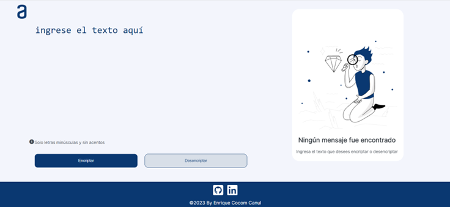

# Encriptador de texto
Repositorio del Challenge Encriptador de Texto - Oracle Next Education y Alura Latam

---

## 📖Caracteristicas

Las "llaves" de encriptación que se utilizaran son las siguientes:

- La letra **"e"** es convertida para **"enter"**
- La letra **"i"** es convertida para **"imes"**
- La letra **"a"** es convertida para **"ai"**
- La letra **"o"** es convertida para **"ober"**
- La letra **"u"** es convertida para **"ufat"**

## ✨Requisitos
Debe funcionar solo con letras minúsculas.
No deben ser utilizados letras con acentos ni caracteres especiales.

Debe ser posible convertir una palabra para la versión encriptada también devolver una palabra encriptada para su versión original.

Por ejemplo:
- gato => "gaitober"
- gaitober" => "gato"

## 📝Instrucciones
- La página debe tener campos para inserción del texto que será encriptado o desencriptado, y el usuario debe poder escoger entre las dos opciones.

- El resultado debe ser mostrado en la pantalla.

## ✅Extras

1. Un botón que copie el texto encriptado/desencriptado para la sección de 2.
2. Transferencia, o sea que tenga la misma funcionalidad del ctrl+C o de la opción "copiar" del menú de las aplicaciones.
## 👨‍💻 Actividades pendientes

- [x] Crear responsive

<h3 align="left">Connect with me:</h3>

--------------------------------------------------------------------------
#### **Autor: Enrique Cocom Canul 👨‍💻🧙‍♂️**